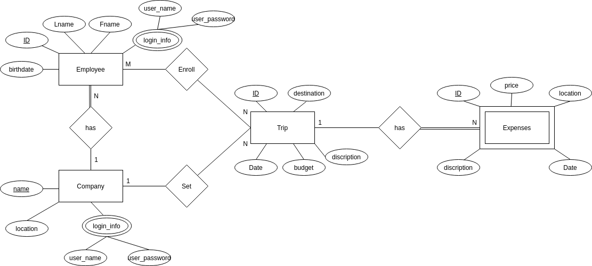
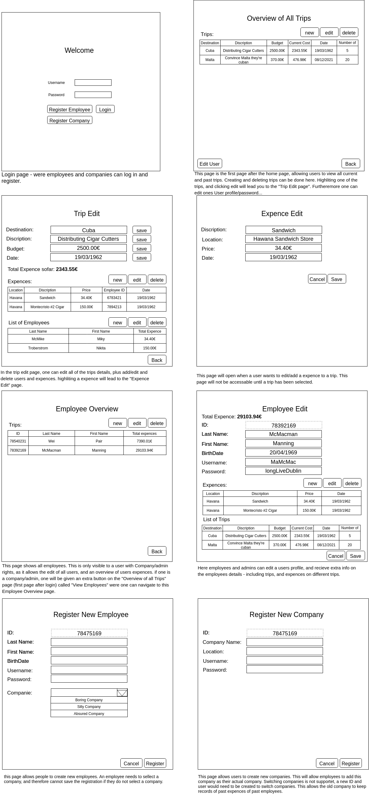

# Backend and Frontend Template

Latest version: https://git.ita.chalmers.se/courses/dit341/group-00-web (public Github [mirror](https://github.com/dit341/group-00-web))

## Project Structure

| File        | Purpose           | What you do?  |
| ------------- | ------------- | ----- |
| `server/` | Backend server code | All your server code |
| [server/README.md](server/README.md) | Everything about the server | **READ ME** carefully! |
| `client/` | Frontend client code | All your client code |
| [client/README.md](client/README.md) | Everything about the client | **READ ME** carefully! |
| [docs/DEPLOYMENT.md](docs/DEPLOYMENT.md) | Free online production deployment | Deploy your app online in production mode |
| [docs/LOCAL_DEPLOYMENT.md](docs/LOCAL_DEPLOYMENT.md) | Local production deployment | Deploy your app local in production mode |

## Requirements

The version numbers in brackets indicate the tested versions but feel free to use more recent versions.
You can also use alternative tools if you know how to configure them (e.g., Firefox instead of Chrome).

* [Git](https://git-scm.com/) (v2) => [installation instructions](https://www.atlassian.com/git/tutorials/install-git)
  * [Add your Git username and set your email](https://docs.gitlab.com/ce/gitlab-basics/start-using-git.html#add-your-git-username-and-set-your-email)
    * `git config --global user.name "YOUR_USERNAME"` => check `git config --global user.name`
    * `git config --global user.email "email@example.com"` => check `git config --global user.email`
  * > **Windows users**: We recommend to use the [Git Bash](https://www.atlassian.com/git/tutorials/git-bash) shell from your Git installation or the Bash shell from the [Windows Subsystem for Linux](https://docs.microsoft.com/en-us/windows/wsl/install-win10) to run all shell commands for this project.
* [Chalmers GitLab](https://git.ita.chalmers.se/) => Login with your **Chalmers CID** choosing "Sign in with" **Chalmers Login**. (contact [support@chalmers.se](mailto:support@chalmers.se) if you don't have one)
  * DIT341 course group: https://git.ita.chalmers.se/courses/dit341
  * [Setup SSH key with Gitlab](https://docs.gitlab.com/ee/ssh/)
    * Create an SSH key pair `ssh-keygen -t ed25519 -C "email@example.com"` (skip if you already have one)
    * Add your public SSH key to your Gitlab profile under https://git.ita.chalmers.se/profile/keys
    * Make sure the email you use to commit is registered under https://git.ita.chalmers.se/profile/emails
  * Checkout the [Backend-Frontend](https://git.ita.chalmers.se/courses/dit341/group-00-web) template `git clone git@git.ita.chalmers.se:courses/dit341/group-00-web.git`
* [Server Requirements](./server/README.md#Requirements)
* [Client Requirements](./client/README.md#Requirements)

## Getting started

```bash
# Clone repository
git clone git@git.ita.chalmers.se:courses/dit341/group-00-web.git

# Change into the directory
cd group-00-web

# Setup backend
cd server && npm install
npm run dev

# Setup frontend
cd client && npm install
npm run serve
```

> Check out the detailed instructions for [backend](./server/README.md) and [frontend](./client/README.md).

## Visual Studio Code (VSCode)

Open the `server` and `client` in separate VSCode workspaces or open the combined [backend-frontend.code-workspace](./backend-frontend.code-workspace). Otherwise, workspace-specific settings don't work properly.

## System Definition (MS0)

### Purpose

The system is designed to assist traveling employees to keep an eye on their spent expenses. This should make it easier for the company to keep record of what the employees travel and living costs are, allowing for a more transparent reimbursement. 

### Pages

* Home: 1-3 sentences describing what the page displays and what a user can do
* Trip Overview: This page is the first page after the home page, allowing users to view all current and past trips. Creating and deleting trips can be done here. Highliting one of the trips, and clicking edit will lead you to the "Trip Edit page". Furtheremore one can edit ones User profile/password...
* Trip Edit: One can edit all of the trips details, plus add/edit and delete users and expences. highliting a expence will lead to the "Expence Edit" page.
* Expense Edit: This page will open when a user wants to edit/add a expence to a trip. This page will not be accessable until a trip has been selected.
* Employee Overview: This page shows all employees. This is only visible to a user with Company/admin rights, as it allows the edit of all users, and an overview of users expences. if one is a company/admin, one will be given an extra button on the "Overview of all Trips" page (first page after login) called "View Employees" were one can navigate to this Employee Overview page.
* Employee Edit: Here employees and admins can edit a users profile, and recieve extra info on the employees details - including trips, and expences on different trips.
* Register Employee: This page allows people to create new employees. An employee needs to sellect a company, and therefore cannot save the registration if they do not select a company.
* Register Company: This page allows users to create new companies. This will allow employees to add this company as their actual company. Switching companies is not supportet, a new ID and user would need to be created to switch companies. This allows the old company to keep records of past expences of past employees.

### Entity-Relationship (ER) Diagram



## Teaser (MS3)


